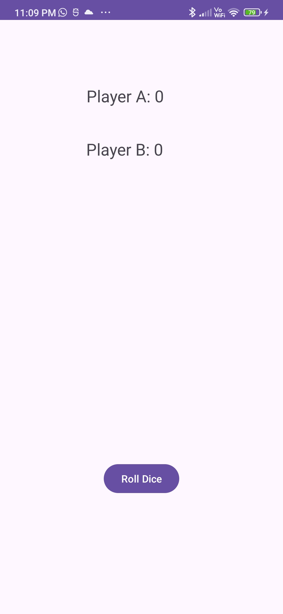
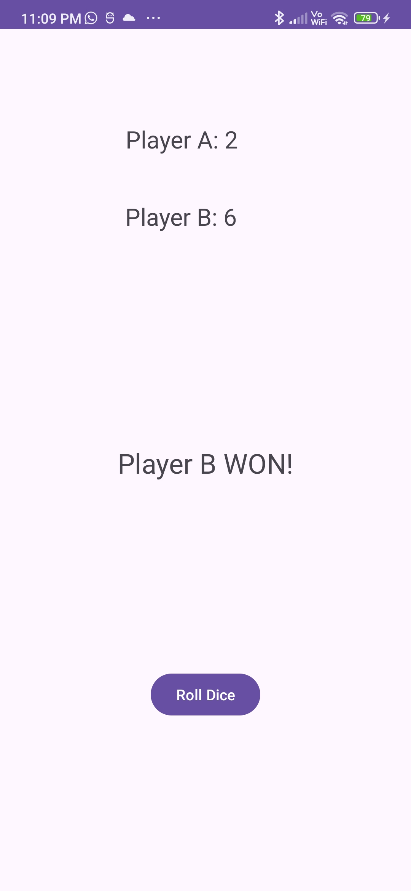

### Android Dice Game App

## Description

This is a simple Android app for playing a dice game between two players, Player A and Player B. The app generates random numbers between 1 and 6 for each player when the "Roll Dice" button is pressed. It then compares the values and declares the winner, displaying the result in an EditText field. The app also handles screen rotation, preserving the dice values.

## Installation

1. Clone the repository:

   ```bash
   git clone https://github.com/Nikhil-Kumar100/DiceGame.git
   ```

2. Open the project in Android Studio.

3. Build and run the app on an emulator or physical device.

## Usage

1. Launch the app on your Android device.

2. Press the "Roll Dice" button to generate random values for Player A and Player B.

3. The app will display the dice values for each player and declare the winner.

4. If you rotate the screen, the app will preserve the dice values.

## Screenshots




## Contributing

Contributions are welcome! If you'd like to contribute to this project, fork the repository, make your changes, and submit a pull request.
